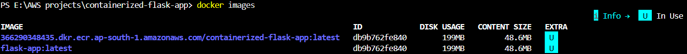
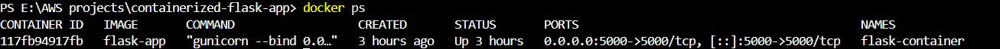
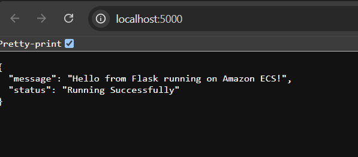
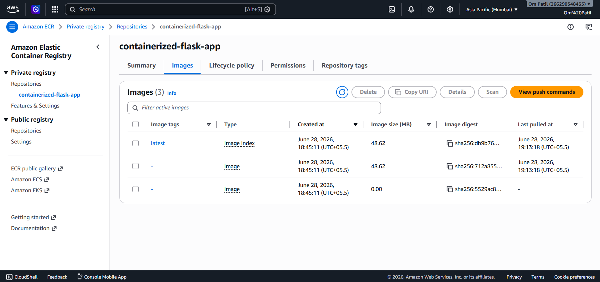
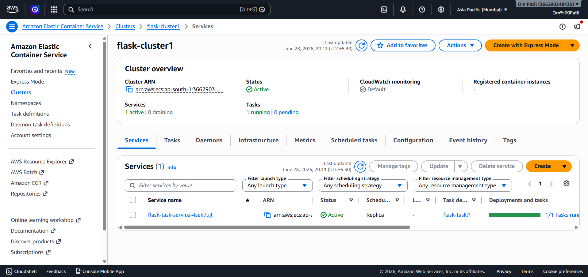
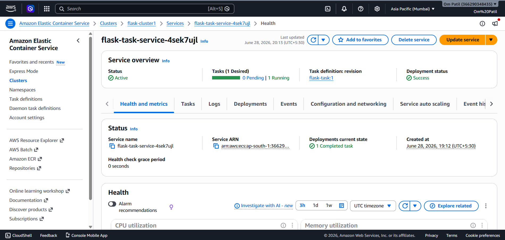

# 🚀 Containerized Flask Application using Docker, Amazon ECR & Amazon ECS

A cloud-native Flask application containerized using **Docker** and deployed on **Amazon ECS (Fargate)**. The Docker image is securely stored in **Amazon Elastic Container Registry (ECR)**, demonstrating an end-to-end container deployment workflow on AWS.

---

## 📌 Project Overview

This project demonstrates how to:

- Develop a Flask web application
- Containerize the application using Docker
- Build and test the Docker image locally
- Store Docker images in Amazon ECR
- Deploy containers using Amazon ECS (Fargate)
- Configure networking and security groups
- Access the application through a public endpoint

---

## 🛠️ Tech Stack

- Python
- Flask
- Docker
- Amazon ECS (Fargate)
- Amazon ECR
- AWS IAM
- Amazon VPC
- Security Groups
- Git & GitHub

---

## 🏗️ Architecture

```
                User
                  │
                  ▼
          Public IP (ECS Task)
                  │
                  ▼
        Amazon ECS (Fargate)
                  │
                  ▼
          Docker Container
                  │
                  ▼
             Flask Application
                  ▲
                  │
        Docker Image stored in
          Amazon Elastic Container Registry (ECR)
```

---

## 📂 Project Structure

```
containerized-flask-app/
│
├── app.py
├── Dockerfile
├── requirements.txt
├── .dockerignore
├── README.md
└── screenshots/
    ├── docker-images.png
    ├── docker-container.png
    ├── local-app.png
    ├── ecr-repository.png
    ├── ecr-image.png
    ├── ecs-cluster.png
    ├── ecs-service.png
    └── deployed-app.png
```

---

## ⚙️ Features

- Dockerized Flask Application
- Local Docker Deployment
- Amazon ECR Integration
- Amazon ECS (Fargate) Deployment
- Publicly Accessible Application
- Secure Container Image Storage
- Cloud Native Deployment

---

## 🚀 Deployment Workflow

1. Developed a Flask application.
2. Created a Dockerfile for containerization.
3. Built the Docker image locally.
4. Tested the container using Docker.
5. Created an Amazon ECR repository.
6. Tagged and pushed the Docker image to Amazon ECR.
7. Created an Amazon ECS Cluster (Fargate).
8. Created a Task Definition.
9. Created an ECS Service.
10. Configured networking and security groups.
11. Successfully deployed the application on AWS.

---

# 📷 Screenshots

## Docker Images



---

## Docker Container Running



---

## Local Application



---

## Amazon ECR Repository



---

## Docker Image in Amazon ECR


---

## Amazon ECS Cluster



---

## Amazon ECS Service



---


## 📈 Skills Demonstrated

- Docker Containerization
- Python Flask Development
- Amazon ECS
- Amazon ECR
- AWS IAM
- VPC Networking
- Security Groups
- Cloud Deployment
- Git & GitHub

---

## 🎯 Learning Outcomes

Through this project, I learned how to:

- Build and manage Docker containers.
- Deploy containerized applications on AWS.
- Use Amazon ECR for container image storage.
- Configure Amazon ECS Fargate services.
- Manage networking and security groups.
- Troubleshoot IAM permissions and deployment issues.
- Deploy scalable cloud-native applications.

---

## 🚀 Future Improvements

- Application Load Balancer (ALB)
- Custom Domain with Route 53
- HTTPS using AWS Certificate Manager
- CloudWatch Monitoring
- Auto Scaling
- CI/CD using GitHub Actions

---

## 👨‍💻 Author

**Om Patil**

- GitHub: https://github.com/OmiiP04
- LinkedIn: https://www.linkedin.com/in/om-patil-ab6774242/

## ⭐ If you found this project useful, consider giving it a star!
